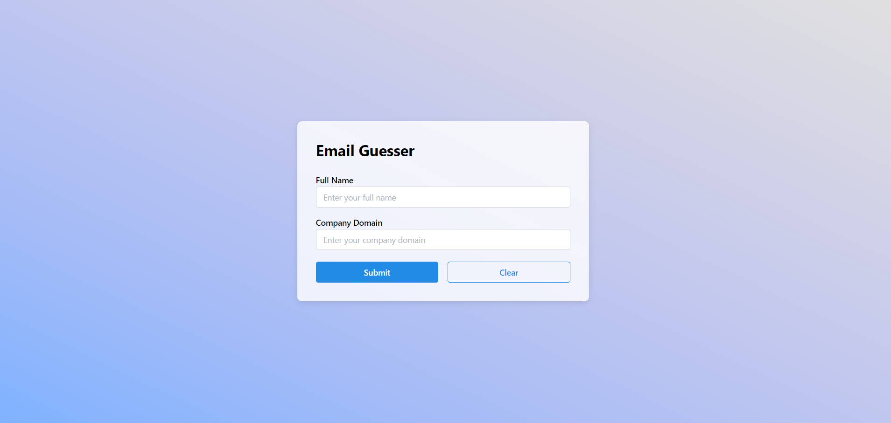
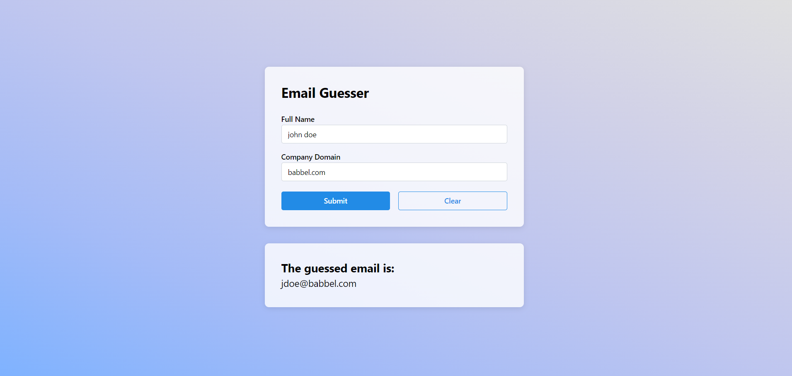

# Email Guesser

A challenge to create an email guesser end to end solution.

## Table of contents

- [The Challenge](#The-Challenge)
- [The Solution](#The-Solution)
  - [Backend](#Backend)
  - [Frontend](#Frontend)

## The Challenge

Let's imagine that we offer a new service to other companies.
The new offering to businesses aims to make us a lucrative option for
companies to promote language learning for their employees. We often reach
out to different representatives from businesses to promote the value
proposition we offer.
We maintain a database of the contacts we already have in various
companies. However, we do not always have the email addresses of the people
we should pitch to in these companies. We do have their full names and
company domain.
In this exercise, you have to create an end to end solution for the use
case above. The solution has two parts:

1. A tiny SPA (Single Page Application) with the UI to accept the full name
   and company domain and display the derived email address. The SPA would
   ideally use React for implementation. You do not have to add authentication
   to the SPA. Design can be minimal and the visual elements can be simple. We
   aren't expecting anything fancy. Also, for the UI - feel free to use your
   creativity :)
2. An HTTP micro service with a single end point to derive email address
   for a person, given their full name and company domain. We can assume that
   all email addresses of one company follow the same format. That is, if we
   know the full name and email address of one person in the company, we
   should be able to derive the email addresses of other employees given their
   full name. Feel free to use any preferred backend language. We
   use JavaScript/TypeScript (NodeJS), Ruby, Python and Go.
   For this exercise, we can assume that the email addresses are always one of
   the following two formats (for an employee called "Jane Doe" working at a
   company with a domain "domain.com"):

- `first_name_last_name`: janedoe@domain.com
- `first_name_initial_last_name`: jdoe@domain.com

Assuming a sample data set exists in a static JSON file such as the one
below:

```json
{
  "Jane Doe": "jdoe@babbel.com",
  "Jay Arun": "jayarun@linkedin.com",
  "David Stein": "davidstein@google.com",
  "Mat Lee": "matlee@google.com",
  "Marta Dahl": "mdahl@babbel.com",
  "Vanessa Boom": "vboom@babbel.com"
}
```

Derive the email addresses of the following contact persons after
determining the email format from the sample set. The service should be
able to handle a request where a derivation is not possible.

1. Nina Simons, "babbel.com"
2. Priya Kuber, "linkedin.com"
3. Matthew Hall, "google.com"
4. Robert Miller, "slideshare.net"

### Points to remember

- Do not spend more than 8 hours on this task.
- We don't expect everything to be finished. Try to focus on completing at
  least one portion of the challenge: frontend or backend.
- Please write tests for (at least) the most significant code flows.
- If you have any questions, feel free to reach out.
- Have fun!

## The Solution

This repository contains the solution to the problem specified in the challenge. The project is divided into `client` and `server` folders. All parts of the solution, whether frontend or backend, are fully functional, yet due to the time constraint, I focused more on the backend part. I chose `pnpm` as the package manager, and Eslint and Prettier are configured for both parts of the solution. Below is a summary of the main features of each part:

## Backend

- NestJS and TypeScript.
- Jest for unit tests.
- One module `email-guesser` that contains the logic for this challenge.
- OpenAPI (Swagger) Support.
- Error handling if the `fullName` or `domain` were not provided in the request body.
- Error handling if the provided `domain` is not in the provided sample dataset.
- One endpoint to derive the email:

```
 [POST]: http://localhost:API_PORT/email-guesser
```

The above endpoint expects this payload in the body:

```
{ fullName*	string
  domain*	number
}
```

And returns the email in the following format:

```
{ email*	string }
```

- Steps to run the backend server:
  - Run `cd server`.
  - Run `pnpm i`.
  - Run `pnpm start` to run the development server.
  - To change the API_PORT, create a `.env` file at the server folder root with the required `API_PORT` value. In my configuration, I have `API_PORT = 5000`.
  - You can now hit the endpoint specified above from any API platform like Postman.
  - To check the OpenAPI documentation, please go to `http://localhost:API_PORT/api` in your browser.
  - To run the unit tests, use `pnpm test`.

## Frontend


_Email guessing UI_


_Result when an email is successfully guessed_

- React, TypeScript, Mantine UI, and Vite.
- Jest and @testing-library/react for unit tests.
- One page for a simple email guessing form.
- Validation for the `Full Name` and the `Company Domain` fields with Mantine Form.
- Error handling is shown to the user in the form of Mantine Notification.
- Displaying the derived email when the submission is successful.
- Steps to run the frontend client:
  - Run `cd client`.
  - Run `pnpm i`.
  - To change the API_URL (if changed for the backend), create a `.env` file at the client folder root with the required `VITE_API_URL` value. In my configuration, I have `VITE_API_URL = "http://localhost:5000"`.
  - The API_URL is `http://localhost:5000` by default. To change this, please add an
  - Run `pnpm start` to run the development server. The project will run by default on `http://localhost:5173/`.
  - To run the unit tests, use `pnpm test`.
